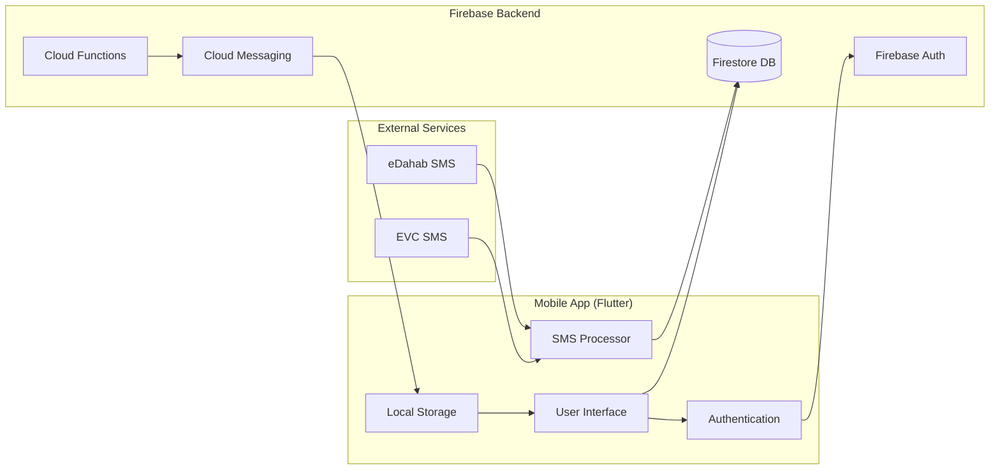

# SMS Transaction Analyzer - System Architecture

## High-Level Architecture



## Component Architecture

### 1. Frontend Layer (Flutter)

- **Transaction Screen**: Main interface for viewing and managing transactions
- **Dashboard Screen**: Financial analytics and charts
- **Budget Screen**: Budget management and monitoring
- **Authentication Screens**: Login and signup interfaces
- **Notification Screen**: User notifications display

### 2. Data Processing Layer

- **SMS Parser**: Extracts transaction data from SMS messages
- **Transaction Model**: Data structure for transaction information
- **Budget Model**: Budget tracking and calculations
- **Notification Model**: Notification data management

### 3. Backend Services (Firebase)

- **Authentication**: User management and security
- **Firestore**: NoSQL database for data storage
- **Cloud Functions**: Serverless backend logic
- **Cloud Messaging**: Push notification delivery

### 4. External Integrations

- **SMS Services**: eDahab and EVC mobile money platforms
- **Device APIs**: Device information and permissions
- **Local Storage**: Secure local data caching

## Data Flow Patterns

### 1. SMS Processing Flow

```
SMS Message → Parse → Validate → Encrypt → Store → Notify
```

### 2. User Authentication Flow

```
Credentials → Validate → Create Session → Store Device Info → Redirect
```

### 3. Budget Monitoring Flow

```
Transaction → Calculate Spent → Check Thresholds → Trigger Alert → Send Notification
```

### 4. Analytics Flow

```
Query Data → Filter → Calculate → Generate Charts → Display
```

## Security Architecture

### Data Protection Layers

1. **Transport Security**: HTTPS/TLS for all network communications
2. **Authentication**: Firebase Auth with email/password
3. **Data Encryption**: AES-256 encryption for sensitive data
4. **Secure Storage**: Encrypted local storage for keys
5. **Device Binding**: Device ID tracking for additional security

### Privacy Considerations

- SMS data is processed locally before encryption
- User data is isolated per user account
- Encryption keys are stored securely on device
- No raw SMS data is transmitted without encryption

## Scalability Considerations

### Current Architecture Benefits

- **Serverless**: Cloud Functions scale automatically
- **NoSQL**: Firestore provides flexible data structure
- **Real-time**: Firestore real-time listeners for live updates
- **Offline Support**: Local storage for offline functionality

### Future Scalability Options

- **Caching**: Implement Redis for frequently accessed data
- **CDN**: Use Firebase Hosting for static assets
- **Microservices**: Break down Cloud Functions into smaller services
- **Database Sharding**: Partition Firestore collections by user/region
